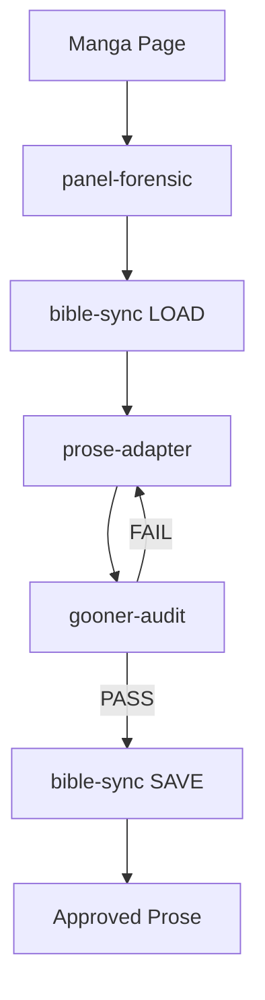

# LND Studio v2.0

> BMAD v6 Compliant Light Novel Development Studio

## Quick Start

```bash
# Core manga adaptation pipeline
/gooner-alchemist

# Direct workflow invocation
/panel-forensic      # Visual forensic analysis
/prose-adapter       # Prose generation (via lewd-writer)
/gooner-audit        # Quality audit (via gooner-editor)
```

## Architecture

```
studio/
├── _templates/          # LND-specific templates
├── config/              # Configuration files
├── workflows/
│   ├── capabilities/    # Specialized workflows
│   │   ├── panel-forensic/   # 7 steps - Visual analysis
│   │   ├── prose-adapter/    # 7 steps - Prose generation
│   │   ├── gooner-audit/     # 5 steps - Quality audit
│   │   └── bible-sync/       # 8 steps - State management
│   └── pipelines/       # Orchestrators
│       └── gooner-alchemist/ # 7 steps - Main pipeline
├── agents/             # Agent definitions
├── knowledge/          # Shared knowledge base
├── assets/             # Static assets
└── docs/               # Documentation
```

## Core Pipeline



## BMAD v6 Compliance

All workflows follow BMAD v6 best practices:

- **Step-file Architecture**: Each step is a separate `.md` file
- **JIT Loading**: Only one step loaded at a time
- **State Tracking**: `stepsCompleted` array in frontmatter
- **Sequential Enforcement**: No step skipping
- **Menu Handling**: Standardized `[C] Continue` pattern

## Quality Standards

### Sensory Density Requirements

| Sense | Minimum | Notes |
|-------|---------|-------|
| Smell | ≥3 | Per page of prose |
| Sound | ≥3 | Including SFX |
| Texture | ≥5 | Tactile descriptions |

### Audit Thresholds

| Score | Status |
|-------|--------|
| ≥85 | PASS |
| 70-84 | REVIEW |
| <70 | FAIL |

## Banned Words (Auto-Fail)

```
hôi thối, dơ bẩn, bẩn thỉu, ghê tởm
đê tiện, đáng khinh, ô uế
```

## Migration from studio/

This directory replaces the legacy `studio/` structure with BMAD v6 compliant workflows. The original `studio/` is retained as backup.

---

*LND Studio - Where Fantasies Become Light Novels*
