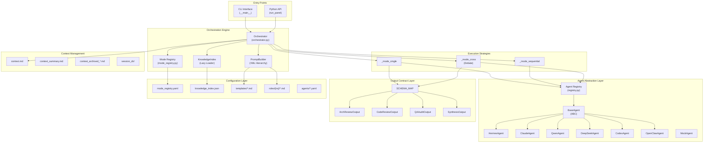
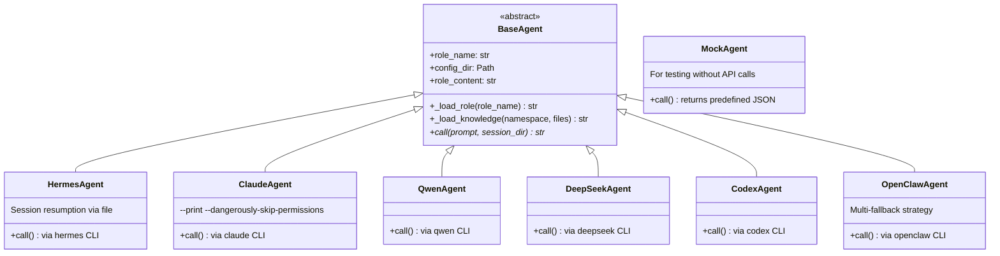
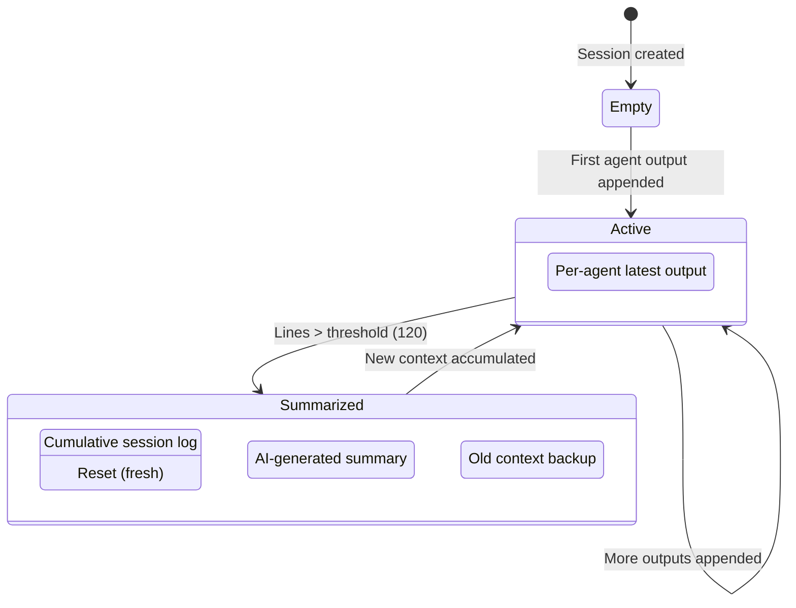
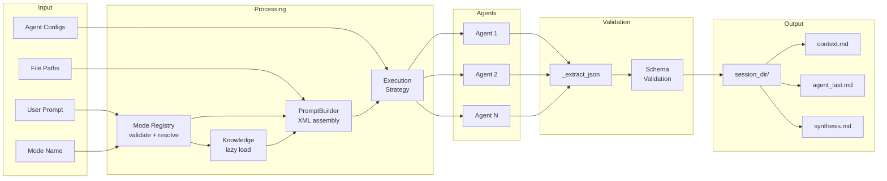

# Axel Multi-Agent Framework — Architecture Design

**Version:** 3.0.0  
**Last Updated:** 2026-05-19  
**Status:** Production Ready  
**Path:** `studio/developers/`

---

## 1. System Overview

Axel is a **multi-agent orchestration framework** that coordinates heterogeneous AI agents (LLM backends) through declarative mode configurations, structured prompt pipelines, and schema-validated outputs.

It is **NOT** a simple skill — it is a **standalone framework** with its own agent abstraction layer, knowledge management system, execution engine, and output contract layer.

### 1.1 Design Principles

| Principle | Implementation |
|-----------|---------------|
| **Declarative-First** | Modes defined in YAML, zero Python changes to add new workflows |
| **Agent-Agnostic** | Any LLM backend (Hermes, Claude, Qwen, DeepSeek, Codex, OpenClaw) via adapter pattern |
| **Schema-Enforced Output** | Every mode output validated by Pydantic before persistence |
| **Token-Efficient** | Lazy knowledge loading + XML context wrapping = 77% token reduction |
| **Isolation-by-Design** | Frozen context in debate mode prevents cross-contamination between agents |

---

## 2. High-Level Architecture



---

## 3. Component Architecture

### 3.1 Orchestration Engine (`orchestrator.py`)

The central coordinator. Responsible for:

- **Mode Dispatch** — Routes to execution strategy based on `execution_type`
- **Agent Instantiation** — Creates agent instances via factory pattern
- **Prompt Assembly** — Builds structured prompts via `PromptBuilder`
- **Schema Validation** — Validates agent output against Pydantic models
- **Context Lifecycle** — Manages session state (append, summarize, archive)

```mermaid
sequenceDiagram
    participant User
    participant CLI
    participant Orchestrator
    participant ModeRegistry
    participant PromptBuilder
    participant Agent
    participant SchemaValidator

    User->>CLI: --task --mode --prompt --agents
    CLI->>Orchestrator: run_panel(task, mode, prompt, agents)
    Orchestrator->>ModeRegistry: validate_mode(mode)
    ModeRegistry-->>Orchestrator: (valid, config)
    Orchestrator->>Orchestrator: Instantiate agents via registry

    alt Single Mode
        Orchestrator->>PromptBuilder: build(system + role + context + task)
        PromptBuilder-->>Orchestrator: structured_prompt
        Orchestrator->>Agent: call(prompt, session_dir)
        Agent-->>Orchestrator: raw_output
        Orchestrator->>SchemaValidator: validate(raw_output, schema)
        SchemaValidator-->>Orchestrator: validated_json
        Orchestrator->>Orchestrator: _write_atomic + _append_context
    end

    alt Debate Mode
        Note over Orchestrator: Freeze context snapshot
        loop Pass 1 — Each Agent (Independent)
            Orchestrator->>Agent: call(frozen_context + prompt)
            Agent-->>Orchestrator: review + <review_summary>
        end
        Note over Orchestrator: Batch-append Pass 1 outputs
        loop Pass 2 — Round-Robin Cross-Examination
            Orchestrator->>Agent: call(other_summaries + challenge)
            Agent-->>Orchestrator: debate_response
        end
        Orchestrator->>Agent: call(synthesis_prompt + schema_instruction)
        Agent-->>Orchestrator: synthesis_json
        Orchestrator->>SchemaValidator: validate(synthesis, SynthesisOutput)
    end
```



### 3.2 Mode Registry (`mode_registry.py`)

Declarative configuration system. Each mode defines:

| Field | Purpose |
|-------|---------|
| `execution_type` | Strategy: `single`, `sequential`, `debate` |
| `template` | Prompt template filename |
| `output_schema` | Pydantic schema class name |
| `knowledge_namespaces` | Which knowledge domains to load |
| `knowledge_files` | Specific files per namespace (lazy loading) |
| `agents.required` | Minimum agent count |
| `agents.roles` | Compatible role identifiers |
| `passes` | Number of debate rounds (debate mode only) |
| `steps` | Ordered step list (sequential mode only) |

**Current Modes:**

```yaml
arch_review:    single    → ArchReviewOutput     # 1 agent
content_audit:  single    → CodeReviewOutput     # 1 agent
prompt_opt:     single    → CodeReviewOutput     # 1 agent
gooner_audit:   single    → QAAuditOutput        # 1 agent
review_debate:  debate    → SynthesisOutput      # 2+ agents
```

### 3.3 Agent Abstraction Layer (`agents/`)



**Agent Registry** (`registry.py`): Factory pattern mapping `agent_id → AgentClass`:

```python
AGENT_MAP = {
    "hermes":   HermesAgent,
    "claude":   ClaudeAgent,
    "qwen":     QwenAgent,
    "openclaw": OpenClawAgent,
    "deepseek": DeepSeekAgent,
    "codex":    CodexAgent,
}
```

### 3.4 PromptBuilder (Structured Prompt Assembly)

Enforces a strict **5-section XML hierarchy** with intelligent truncation:

```
┌─────────────────────────────────────────┐
│ <system_rules>    ← Knowledge rules     │  NEVER truncated
│ <agent_persona>   ← Role definition     │  NEVER truncated
│ <context>         ← Session context     │  TRUNCATED if over budget
│ <task_instruction>← User prompt         │  NEVER truncated
│ <constraint>      ← Output constraints  │  NEVER truncated
└─────────────────────────────────────────┘
```

**Token Budget Algorithm:**
1. Calculate `protected_chars` = system + role + task + constraints
2. `context_budget` = `max_chars` - `protected_chars` - 100 (margin)
3. If `context > context_budget` → truncate context only, preserve XML tags

### 3.5 Knowledge System

**Two-tier architecture:**

```
knowledge_index.json          ← Manifest (namespace → path + files)
  └── config/roles/
      ├── se/rules/           ← Software Engineering domain
      │   ├── global_rule_hub.md
      │   ├── system.md
      │   ├── delegation_protocol.md
      │   └── ...
      ├── dev/rules/          ← Development/Content domain
      │   ├── anti_slop.md
      │   ├── sensory_density.md
      │   ├── gooner_principles.md
      │   └── ... (17 files)
      └── qa/rules/           ← Quality Assurance domain
          └── GOONER_AUDIT_FRAMEWORK.md
```

**Loading Strategy:**
- **Lazy (recommended):** Mode specifies exact files → 80% token reduction
- **Greedy (deprecated):** Loads all files in namespace → token waste

**XML Output Format:**
```xml
<knowledge namespace='se' description='...'>
  <rule file='system.md'>...content...</rule>
  <rule file='delegation_protocol.md'>...content...</rule>
</knowledge>
```

### 3.6 Output Contract Layer (`schemas/`)

All agent outputs validated via Pydantic v2 with strict constraints:

| Schema | Fields | Used By |
|--------|--------|---------|
| `ArchReviewOutput` | findings, severity, implications, action_plan | `arch_review` mode |
| `CodeReviewOutput` | issues[], overall_score, verdict, summary | `content_audit`, `prompt_opt` |
| `QAAuditOutput` | f/s/p/i_score, total_score, verdict, critical_flaws | `gooner_audit` |
| `SynthesisOutput` | conclusions[], consensus_level, execution_order | `review_debate` |

**Validation Flow:**
```
Agent Output → _extract_json() → model_validate_json() → model_dump_json()
                ↑ strips markdown        ↑ Pydantic validation    ↑ clean JSON
                  code fences              raises ValidationError   for persistence
```

**Halt-on-Invalid Policy:** If schema validation fails, execution **HALTs** immediately. No invalid output is persisted to context.

### 3.7 Context Management



**Key invariants:**
- `_write_atomic()` — Uses temp file + `os.replace()` for crash-safe writes
- `_inject_context()` — Returns XML-wrapped context, does NOT embed task prompt (P3 fix)
- Frozen context in debate mode — Snapshot taken BEFORE Pass 1 loop

---

## 4. Execution Strategies

### 4.1 Single (`_mode_single`)

```
User Prompt → PromptBuilder → Agent.call() → Schema Validation → Persist
```

One agent, one template, one schema. Simplest execution path.

### 4.2 Sequential (`_mode_sequential`)

```
Step 1: mode=arch, agent[0] → ArchReviewOutput
Step 2: mode=code, agent[1] → CodeReviewOutput
Step N: mode=X,    agent[N] → SchemaX
```

Each step is a `_mode_single` call with a different mode/agent pair. Steps share the same session context — each agent sees prior agents' outputs.

### 4.3 Debate (`_mode_cross`)

The most complex strategy with **3 phases**:

```
Phase 1 — Independent Review (Frozen Context)
  ├── Agent A: review + <review_summary>
  ├── Agent B: review + <review_summary>
  └── Agent N: review + <review_summary>
  → Batch-append ALL outputs AFTER loop

Phase 2 — Round-Robin Cross-Examination
  ├── Agent A challenges B,C,...N summaries
  ├── Agent B challenges A,C,...N summaries
  └── Agent N challenges A,B,...(N-1) summaries

Phase 3 — Synthesis (Lead Agent)
  └── Agent A synthesizes all summaries + debates
      → Schema-validated SynthesisOutput (JSON)
```

**Critical Design Decisions:**
1. **Context Freezing (P0):** All agents receive identical `frozen_context` snapshot in Phase 1
2. **Summary-Only Cross-Exam (P0):** Phase 2 reads `<review_summary>` tags, not full outputs
3. **Round-Robin (P2):** Every agent challenges every other agent (not just agent[0] vs agent[1])
4. **Schema Injection:** JSON Schema is embedded directly in synthesis prompt

---

## 5. Directory Structure

```
studio/developers/
├── ARCHITECTURE.md              # This document
├── README.md                    # User-facing guide
├── MODE_REGISTRY_GUIDE.md       # Mode configuration guide
├── __init__.py
├── orchestrator.py              # Core engine (602 lines)
├── mode_registry.py             # YAML registry loader (118 lines)
├── requirements.txt             # Python dependencies
│
├── agents/                      # Agent Abstraction Layer
│   ├── __init__.py
│   ├── base.py                  # BaseAgent ABC (71 lines)
│   ├── registry.py              # Factory + AGENT_MAP (30 lines)
│   ├── hermes_agent.py          # Hermes CLI adapter
│   ├── claude_agent.py          # Claude Code CLI adapter
│   ├── qwen_agent.py            # Qwen CLI adapter
│   ├── deepseek_agent.py        # DeepSeek CLI adapter
│   ├── codex_agent.py           # Codex CLI adapter
│   ├── openclaw_agent.py        # OpenClaw CLI adapter (multi-fallback)
│   └── mock_agent.py            # Test mock (no API calls)
│
├── schemas/                     # Output Contract Layer
│   ├── __init__.py              # Re-exports all schemas
│   ├── arch_review.py           # ArchReviewOutput
│   ├── code_review.py           # CodeReviewOutput + CodeReviewIssue
│   ├── qa_audit.py              # QAAuditOutput
│   └── synthesis.py             # SynthesisOutput + SynthesisConclusion
│
└── config/                      # Configuration Layer
    ├── mode_registry.yaml       # Mode definitions + settings
    ├── knowledge_index.json     # Knowledge namespace manifest
    │
    ├── agents/                  # Per-agent config (YAML)
    │   ├── claude.yaml
    │   ├── codex.yaml
    │   ├── deepseek.yaml
    │   ├── openclaw.yaml
    │   └── qwen.yaml
    │
    ├── templates/               # Prompt templates
    │   ├── arch_review.md
    │   └── code_review.md
    │
    └── roles/                   # Knowledge base
        ├── se/                  # Software Engineering
        │   ├── m-architect.md   # Role persona
        │   └── rules/           # Domain rules (7 files)
        ├── dev/                 # Development/Content
        │   ├── m-prompt-expert.md
        │   ├── f-r18-expert.md
        │   └── rules/           # Domain rules (17 files)
        └── qa/                  # Quality Assurance
            ├── m-qa-gooner.md
            └── rules/           # Domain rules (1 file)
```

---

## 6. Data Flow Diagram



---

## 7. Extension Points

### 7.1 Adding a New Agent

1. Create `agents/my_agent.py` extending `BaseAgent`
2. Implement `async def call(self, prompt, session_dir, **kwargs) -> str`
3. Register in `agents/registry.py`: `AGENT_MAP["myagent"] = MyAgent`

### 7.2 Adding a New Mode

1. Add entry in `config/mode_registry.yaml` under `modes:`
2. Create template in `config/templates/` (if `single` type)
3. Create schema in `schemas/` (if `output_schema` specified)
4. Register schema in `orchestrator.py` `SCHEMA_MAP`
5. **No orchestrator logic changes needed**

### 7.3 Adding a New Knowledge Namespace

1. Create directory `config/roles/{namespace}/rules/`
2. Add role persona `config/roles/{namespace}/{role}.md`
3. Register in `config/knowledge_index.json`
4. Reference in mode's `knowledge_namespaces` + `knowledge_files`

### 7.4 Adding a New Schema

1. Create Pydantic model in `schemas/{name}.py`
2. Re-export in `schemas/__init__.py`
3. Add to `SCHEMA_MAP` in `orchestrator.py`
4. Reference in mode's `output_schema` field

---

## 8. Key Invariants & Safety Guarantees

| Invariant | Mechanism |
|-----------|-----------|
| **No cross-contamination in debate** | Context frozen before Pass 1 loop |
| **No invalid output persisted** | Schema validation HALTs on failure |
| **No token explosion** | PromptBuilder truncates ONLY context section |
| **No broken XML tags** | Truncation appends closing `</context>` tag |
| **Atomic file writes** | `_write_atomic()` via tempfile + `os.replace()` |
| **No task prompt duplication** | `_inject_context()` does NOT embed prompt (P3 fix) |

---

## 9. Version History

| Version | Date | Changes |
|---------|------|---------|
| 3.0.0 | 2026-05-19 | P0-P3 bug fixes, SynthesisOutput schema, round-robin debate, JSON extraction, architecture doc |
| 2.0.0 | 2026-05-16 | Mode registry YAML, lazy knowledge loading, 77% token reduction |
| 1.0.0 | 2026-05-15 | Initial: schema validation, XML context, agent registry |

---

**Maintained by:** LND Studio Development Team  
**Framework Codename:** Axel  
**Status:** ✅ Production Ready
