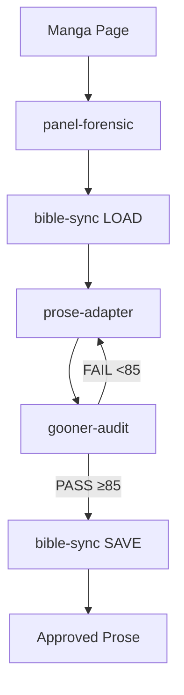
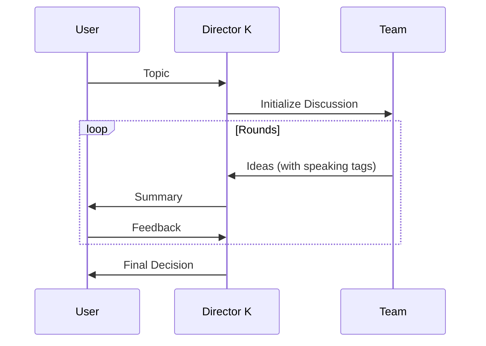

# LND Studio - AI Agent Technical Guide

> **Version**: 2.0 | **Last Updated**: 2026-02-09
> **Audience**: AI Agents (LLMs) operating within LND Studio framework

---

## 1. Architecture Overview

LND Studio follows a **Hierarchical Agentic Workflow** pattern:

```
┌─────────────────────────────────────────────────────────────────┐
│                        ENTRY LAYER                              │
│                  .agent/workflows/*.md                          │
│                 (Slash commands trigger agents)                 │
├─────────────────────────────────────────────────────────────────┤
│                        AGENT LAYER (L1/L2/L3)                   │
│  ┌──────────────┐  ┌──────────────┐  ┌──────────────┐          │
│  │ L1: Director │→ │ L2: Devs     │→ │ L3: QA       │          │
│  │ (Orchestrate)│  │ (Create)     │  │ (Validate)   │          │
│  └──────────────┘  └──────────────┘  └──────────────┘          │
├─────────────────────────────────────────────────────────────────┤
│                       WORKFLOW LAYER                            │
│  pipelines/          capabilities/         utilities/           │
│  (Multi-phase)       (Single-purpose)      (Helpers)            │
├─────────────────────────────────────────────────────────────────┤
│                        MODULE LAYER                             │
│  sfx-lookup │ fetish-guidance │ gooner-audit-engine │ style    │
├─────────────────────────────────────────────────────────────────┤
│                      KNOWLEDGE LAYER                            │
│  glossaries/ │ fetish-db/ │ style-guides/ │ roleplay/          │
├─────────────────────────────────────────────────────────────────┤
│                        RULES LAYER                              │
│             .agent/rules/*.md (Always Active)                   │
└─────────────────────────────────────────────────────────────────┘
```

---

## 2. Agent Hierarchy

### L1: Management (Orchestrator)
| Agent | Name | Slash Command | Role |
|-------|------|---------------|------|
| lnd-orchestrator | Director K 🎬 | `/lnd-orchestrator` | Studio Director, delegates tasks |

### L2: Developers (Specialists)
| Agent | Name | Slash Command | Role |
|-------|------|---------------|------|
| lewd-writer | Suki 🖋️ | `/lewd-writer` | R18 prose writing |
| dialogue-crafter | Miki 💬 | `/dialogue-crafter` | Dialogue & SFX |
| character-architect | Aria 👩‍🎨 | `/character-architect` | Character profiles |
| world-weaver | Luna 🕸️ | `/world-weaver` | World-building |
| sillytavern-expert | Tavvy 📤 | `/sillytavern-expert` | ST card export |

### L3: Quality Assurance
| Agent | Name | Slash Command | Role |
|-------|------|---------------|------|
| gooner-editor | Riko 🧐 | `/gooner-editor` | QA & audit |

---

## 3. Activation Protocol

When invoked via slash command, agents MUST:

```xml
<activation-sequence>
  1. Load agent persona (already in context from entry point)
  2. Load {project-root}/studio/config/config.yaml
     - Extract: user_name, communication_language, output_folder
  3. Store variables for session
  4. Display greeting in {communication_language}
  5. Show numbered menu
  6. WAIT for user input (never auto-execute)
  7. Process input via fuzzy matching
  8. Execute selected menu item
</activation-sequence>
```

---

## 4. Rules (Always Active)

Rules in `.agent/rules/` are **automatically loaded** and apply during all R18 content generation:

| Rule | Purpose | Priority |
|------|---------|----------|
| `pervert_pov.md` | Neutral camera perspective | 1 |
| `dialogue_format.md` | Language & SFX formatting (**Single Source of Truth**) | 2 |
| `sensory_density.md` | Minimum sensory counts | 3 |
| `quality_gates.md` | Pass/fail thresholds | 4 |
| `continuity.md` | State tracking across scenes | 5 |

### Critical Language Rule

| Element | Language | Example |
|---------|----------|---------|
| Prose/Narrative | Vietnamese | *Cô nàng ưỡn người...* |
| Dialogue | Vietnamese + honorifics | 「Onii-chan~? Anh đến muộn quá đó~」 |
| **SFX** | **Romanized Japanese ONLY** | guchu guchu, pan pan, zuchu~ |

> ❌ **NEVER**: Kanji (ぐちゅ), Vietnamese SFX (bì bạch), Hiragana/Katakana

---

## 5. Module Integration

Modules extend agent capabilities with knowledge-backed functions:

| Module | Load When | Knowledge Source |
|--------|-----------|------------------|
| `sfx-lookup.md` | Writing SFX | `glossaries/`, `fetish-db/moaning*` |
| `fetish-guidance.md` | Character fetish design | `fetish-db/` (30 files) |
| `gooner-audit-engine.md` | Quality scoring | `docs/GOONER_AUDIT_FRAMEWORK.md` |
| `style-enforcer.md` | Archetype validation | `style-guides/`, research files |
| `sillytavern-export.md` | ST V3 card creation | `docs/sillytavern-expert-sidecar/` |

### Module Loading Pattern

```xml
<module-load>
  1. Agent receives task requiring specialized knowledge
  2. Agent loads relevant module from studio/modules/
  3. Module provides capabilities + knowledge references
  4. Agent executes using module guidance
</module-load>
```

---

## 6. Workflow Execution

### Workflow Types

| Type | Location | Purpose |
|------|----------|---------|
| Pipeline | `workflows/pipelines/` | Multi-phase orchestration |
| Capability | `workflows/capabilities/` | Single-purpose workflows |
| Utility | `workflows/utilities/` | Helper functions |

### Step-File Architecture

Each workflow uses separate step files:

```
workflow/
├── workflow.md          # Main entry + frontmatter
├── steps/
│   ├── step-01-*.md     # Individual steps
│   ├── step-02-*.md
│   └── ...
├── data/                # Context data (optional)
└── templates/           # Output templates (optional)
```

### JIT Loading Rule

> **CRITICAL**: Load ONLY ONE step file at a time. Complete current step before loading next.

---

## 7. Delegation Protocol (L1 Only)

Director K MUST delegate specialized tasks:

| Task Type | Delegate To |
|-----------|-------------|
| Panel/Image Analysis | Prof. Atomic (panel-forensic-analyst) 🔬 |
| Prose Writing | Suki (lewd-writer) ✍️ |
| Dialogue/SFX | Miki (dialogue-crafter) 💬 |
| Character Profile | Aria (character-architect) 👩‍🎨 |
| World-Building | Luna (world-weaver) 🕸️ |
| Quality Audit | Riko (gooner-editor) 🧐 |

### Delegation Visual Format

```
─────────────────────────────────────────────
📤 DELEGATING TO: [Agent Name] ([Agent Role])
📋 TASK: [Brief task description]
─────────────────────────────────────────────
```

---

## 8. Quality Gates

### Scoring Thresholds

| Score | Grade | Action |
|-------|-------|--------|
| 95-100 | 🔥 GOONER PERFECTION | Publish |
| 85-94 | ✅ APPROVED | Publish ready |
| 70-84 | ⚠️ NEEDS REVISION | Revise |
| <70 | ❌ FAILED | Major rewrite |

**Minimum Pass: 85 points**

### Sensory Minimums

| Sense | Per Page | Per Action |
|-------|----------|------------|
| Smell | ≥3 | - |
| Sound/SFX | - | ≥3 |
| Texture | ≥5 | - |
| Temperature | Every fluid contact | - |

---

## 9. Core Pipelines

### Gooner Alchemist (Manga → Prose)



### Party Mode (Team Discussion)



---

## 10. File Paths Reference

| Resource | Path |
|----------|------|
| Agents | `studio/agents/{L1,L2,L3}/` |
| Modules | `studio/modules/` |
| Workflows | `studio/workflows/{pipelines,capabilities}/` |
| Knowledge | `studio/knowledge/` |
| Config | `studio/config/config.yaml` |
| Rules | `.agent/rules/` |
| Entry Points | `.agent/workflows/` |

---

## 11. Common Patterns

### Output File Naming

```
{output_folder}/{project_name}/
├── prose/
│   ├── chapter-01/
│   │   ├── page-001.md
│   │   └── page-002.md
├── analysis/
│   └── forensic-page-001.md
└── exports/
    └── character-card.png
```

### State Management (Bible Sync)

```
bible-sync LOAD → Read existing state
bible-sync SAVE → Persist updated state

State includes:
- Character positions
- Clothing state
- Fluid residue
- Relationship dynamics
```

---

*LND Studio v2.0 - BMAD v6 Compliant*
