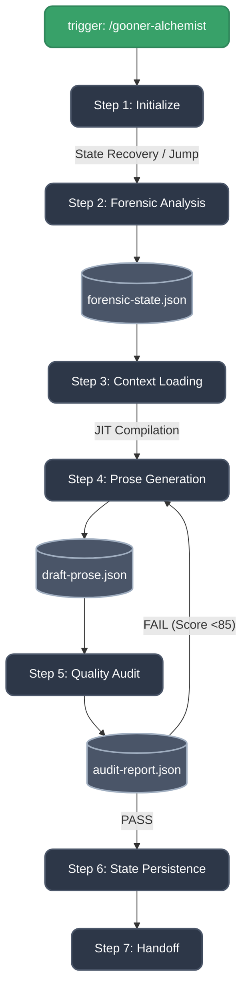

# LND Studio Architecture (v2.0)

> **BMAD v6 Compliant Framework for Light Novel Development**
> Documented by Paige, Technical Documentation Specialist.

## 1. Top-Level Structure

LND Studio is structured as a dedicated BMAD Module, governed by `module.yaml`. It heavily utilizes dynamic JIT (Just-In-Time) loading, micro-file architectures, and agent registries to minimize token waste and maximize structural discipline.

```text
lnd_dev/
└── studio/
    ├── module.yaml                # BMAD Module definition
    ├── agent-registry.csv         # Dynamic dispatch registry for all 14 agents
    ├── patch_schemas.py           # Utility to lock down JSON schemas
    ├── README.md                  # Project entry point
    │
    ├── agents/                    # 14 specialized BMAD .agent.yaml files
    │
    ├── config/                    # Global pipeline context & configurations
    │   └── pipeline-context.md    # Master rules & lore mechanics
    │
    ├── docs/                      # Architectural documentation (You are here)
    │   └── ARCHITECTURE.md
    │
    ├── schemas/                   # Strict JSON Schemas preventing LLM hallucination
    │   ├── audit-report.schema.json
    │   ├── draft-prose.schema.json
    │   └── forensic-state.schema.json
    │
    ├── scripts/                   # Utility Scripts
    │   └── simulator.py           # JIT Payload Simulator for offline testing
    │
    ├── services/                  # Business-logic pipelines
    │   └── gooner-alchemist/      # Core 7-step adaptation pipeline
    │       ├── workflow.md
    │       └── steps/             # Micro-file step architecture
    │
    └── shared/                    # Reusable workflows
        └── party-mode/            # Multi-agent discussion facilitator
```

---

## 2. Core Operational Pipeline: Gooner Alchemist

The primary engine of LND Studio is the **Gooner Alchemist** pipeline, orchestrated by Director K (`lnd-orchestrator.agent.yaml`). This pipeline is built out of isolated step files located in `studio/services/gooner-alchemist/steps/`.



### JIT Context Compilation

To preserve LLM Context Windows, Step 3 compiles a **JIT Payload** by merging exactly the rules needed for the current translation phase, and discarding the rest.
This payload structure is strictly simulated via `studio/scripts/simulator.py`.

---

## 3. The Agent Roster (14 Specialists)

The studio utilizes a dynamic agent registry (`studio/agent-registry.csv`) to instantiate agents dynamically through the BMAD framework.

* **Director K (`lnd-orchestrator`)** - The master pipeline controller with circuit breakers.
* **Kana (`manga-adapter`)** - Visual extraction and panel forensic analysis.
* **Suki (`lewd-writer`)** - The core R18 prose writer enforcing sensory mechanics.
* **Riko (`gooner-editor`)** - The ruthless QA gatekeeper scoring against schemas.
* **Luna (`world-weaver`)** - Consistency checker for setting, lore, and logic.
* **Miki (`dialogue-crafter`)** - Pre-processor for R18 degradation dialogue and Japanese SFX mapping.
* **Orion (`continuity-enforcer`)** - State tracker, ensuring biological and physical realities persist between pages.
* **Mavis (`system-engineer`)** - Metaphysical pipeline performance and architecture evaluator.
* *(And 6 other supporting agents managing UI, lore, and structural formats).*

---

## 4. Strict Schema Enforcement

The studio utilizes pure JSON Schemas enforced at the LLM level. Every schema utilizes recursive `"additionalProperties": false` constraints to strictly prevent structural hallucinations from large language models.

* `draft-prose.schema.json`: Enforces strict word counts, format compliance arrays, and sensory thresholds.
* `audit-report.schema.json`: Structures Riko's brutal grading logic and actionable rewrites.
* `forensic-state.schema.json`: Holds the explicit mapping of character limbs, expressions, subtext, and environmental odours.
