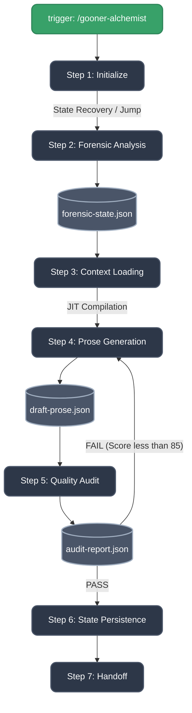

# LND Studio Architecture (v4.0)

> **BMAD v7.0 Compliant Framework for Light Novel Development**
> Documented by Paige, Technical Documentation Specialist.

## 1. Top-Level Structure

LND Studio is structured as a dedicated BMAD Module, governed by `module.yaml` (v7.0.0). It follows the **SKILL.md Convention** for all components — every service, core engine, and module has a standardized `SKILL.md` entry point with YAML frontmatter, activation protocol, and routing tables.

```text
lnd_dev/
└── studio/
    ├── module.yaml                # BMAD Module definition
    ├── agent-registry.csv         # Dynamic dispatch registry (14 agents + skill refs)
    ├── README.md                  # Project entry point
    │
    ├── agents/                    # 14 specialized BMAD .agent.yaml files
    │
    ├── core/                      # Foundation engines (each with SKILL.md)
    │   ├── lewd-writer/           # R18 prose generation (10 steps)
    │   ├── panel-forensic/        # Visual forensic analysis (5 steps)
    │   ├── transformation-engine/ # Knowledge injection + orchestration
    │   └── party-mode/            # Multi-agent discussion facilitator
    │
    ├── services/                  # Business-logic pipelines (each with SKILL.md)
    │   ├── gooner-alchemist/      # Core 8-step adaptation pipeline
    │   ├── quality-audit/         # 100-point QA scoring (5 steps)
    │   ├── bible-sync/            # State persistence (LOAD/SAVE modes)
    │   ├── character-builder/     # Character profiling
    │   ├── dialogue-scripting/    # R18 dialogue & SFX (6 steps)
    │   ├── entity-extractor/      # Character data extraction
    │   ├── scene-expansion/       # Outline → full prose
    │   ├── chapter-composer/      # Pages → chapter compilation
    │   ├── release-compiler/      # Delivery packaging
    │   ├── renpy-adaptation/      # Ren'Py game adaptation
    │   ├── st-card-export/        # SillyTavern card export
    │   └── rpg-adapter/           # RPG Maker adaptation (V1)
    │
    ├── modules/                   # Knowledge-backed modules (each with SKILL.md)
    │   ├── module.yaml            # Package manifest
    │   ├── sfx-lookup/            # SFX lookup & suggestions
    │   ├── fetish-guidance/       # Fetish patterns & escalation
    │   ├── gooner-audit-engine/   # 100-point scoring logic
    │   ├── style-enforcer/        # Style & archetype validation
    │   └── sillytavern-export/    # ST V3 card export logic
    │
    ├── shared/                    # Cross-cutting shared skills
    │   ├── agent-memory/          # Persistent learning layer
    │   └── onboarding/            # Context grounding session
    │
    ├── config/                    # Global pipeline context + data
    │   ├── profiles/              # Character profiles
    │   └── corpus/                # Character corpus data
    ├── schemas/                   # Strict JSON Schemas (4 schemas)
    ├── knowledge/                 # Knowledge base (fetish-db, glossaries, style-guides)
    ├── _templates/                # Scaffolding templates
    │   └── new-skill-template/    # Starter for new skills
    ├── scripts/                   # Python automation scripts
    ├── tools/                     # External tools (RPG decrypter, etc.)
    ├── rules/                     # Studio-level rule hub
    └── output/                    # Runtime output (generated files)
```

---

## 2. SKILL.md Convention

Every component (service, core engine, module) follows a standardized structure:

```
component-name/
├── SKILL.md          # Entry point with YAML frontmatter
├── steps/            # Multi-step workflow files
├── references/       # Static knowledge/context
├── resources/        # Runtime data, templates
└── tools/            # Composable sub-tools
```

**SKILL.md requirements:**

- YAML frontmatter with `name` and `description`
- `## Overview` — what the skill does
- `## On Activation` — numbered setup/routing steps
- `## Steps` — table mapping step files
- `## Dependencies` — agent, schemas, modules
- `## Quick Reference` — intent → trigger → route mapping

### Two-Layer Documentation Pattern

Services follow a two-layer documentation pattern:

| Layer | File | Purpose |
|-------|------|---------|
| **Entry Point** | `SKILL.md` | Overview, activation protocol, routing — what an agent reads first |
| **Implementation Reference** | `references/workflow.md` | Detailed step logic, scoring rubrics, schemas — what an agent reads during execution |

`SKILL.md` is the **single source of truth** for discovery and routing. `workflow.md` contains implementation details that are too verbose for the entry point.

### Path Conventions

Two path prefixes are used across the studio:

| Prefix | Scope | Example |
|--------|-------|---------|
| `{project-root}/studio/...` | Studio-internal paths | `{project-root}/studio/config/config.yaml` |
| `{project-root}/.agent/rules/...` | Project-level writing rules | `{project-root}/.agent/rules/sensory_density.md` |

The `.agent/rules/` directory lives at the project root (not inside studio) because these rules apply to the entire project, not just the studio framework.

---

## 3. Core Operational Pipeline: Gooner Alchemist

The primary engine is the **Gooner Alchemist** pipeline, orchestrated by Director K. See `services/gooner-alchemist/SKILL.md` for full details.



---

## 4. The Agent Roster (14 Specialists)

The studio utilizes a dynamic agent registry (`agent-registry.csv`) with skill cross-references. Each agent maps to a primary skill implementation.

| Code | Name | Primary Skill | Role |
|------|------|---------------|------|
| DIR | Director K | `services/gooner-alchemist` | Master Orchestrator |
| GA | Kana | `core/panel-forensic` | Visual Forensic Analysis |
| MOD | Suki | `core/lewd-writer` | R18 Prose Generation |
| QA | Riko | `services/quality-audit` | Quality Gatekeeper |
| CB | Aria | `services/character-builder` | Character Profiling |
| DC | Miki | `services/dialogue-scripting` | Dialogue & SFX |
| CE | Orion | `services/bible-sync` | Continuity Enforcement |
| CC | Composer | `services/release-compiler` | Release Packaging |
| SE | Mavis | — | Architecture Evaluation |
| LM | Luna | — | World Building |

---

## 5. Strict Schema Enforcement

All JSON outputs use recursive `"additionalProperties": false` constraints:

- `forensic-state.schema.json` — character positions, dialogue, environmental data
- `draft-prose.schema.json` — word counts, format compliance, sensory thresholds
- `audit-report.schema.json` — grading logic, actionable rewrites
- `continuity-ledger.schema.json` — state persistence across pages

---

## 6. Directory Organization Rationale

| Directory | Count | Purpose |
|-----------|-------|---------|
| `core/` | 4 | Foundation engines — heavy computation |
| `services/` | 12 | Business-logic pipelines — orchestration |
| `modules/` | 5 | Reusable knowledge-backed utilities |
| `shared/` | 2 | Cross-cutting capabilities (memory, onboarding) |
| `agents/` | 14 | BMAD agent YAML definitions |
| `config/` | — | Pipeline context, profiles, corpus, knowledge config |
| `knowledge/` | — | Fetish-db, glossaries, style-guides |
| `schemas/` | 4 | JSON Schema validation |
| `docs/` | — | Documentation, audit history |
| `scripts/` | 4 | Python automation (extract, repair, simulate) |
| `tools/` | — | External repos (RPG-Maker-MV-Decrypter) |
| `_templates/` | — | Scaffolding templates for new skills |
| `rules/` | 1 | Studio-level rule hub (indexes `.agent/rules/`) |
| `assets/` | — | Static assets (SFX library, ST templates) |
| `output/` | — | Runtime generated files |
