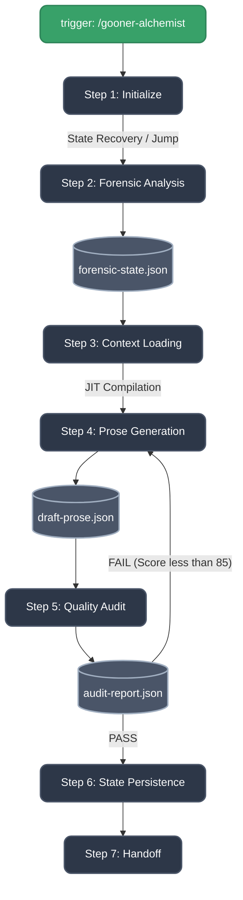

# LND Studio Architecture (v7.0)

> **BMAD v7.0 Compliant Framework for Light Novel Development**
> Refactored: 2026-05-02

## 1. 6-Layer Architecture

LND Studio operates on a **6-layer architecture** that separates concerns and enables modular, scalable agent orchestration:

```
┌──────────────────────────────────────────────────────────────┐
│  LAYER -1: INFRASTRUCTURE (Shared Concerns)                │
│  ├── schemas/           # JSON contracts (authoritative)    │
│  ├── rules/            # Global writing rules              │
│  ├── shared/           # Cross-cutting (onboarding, memory) │
│  └── context/mandatory/ # Always-loaded context             │
└──────────────────────────────────────────────────────────────┘

┌──────────────────────────────────────────────────────────────┐
│  LAYER 0: KNOWLEDGE BASE (Centralized Brain)                │
│  ├── knowledge/        # Canonical KB                        │
│  │   ├── fetish-db/   # 23 research files                   │
│  │   ├── sfx/         # Sound effects                        │
│  │   ├── glossaries/  # Terminology                          │
│  │   ├── packs/       # Structured knowledge                 │
│  │   └── trope_beat_sheets/ # Scene templates               │
│  └── knowledge-index.yaml # Maps: file → skills_using_it   │
└──────────────────────────────────────────────────────────────┘

┌──────────────────────────────────────────────────────────────┐
│  LAYER 1: ABSTRACT / ORCHESTRATION (Entry Point)            │
│  └── agents/lnd-orchestrator.agent.yaml                   │
│      ├── OWNS: manga-adapter, lewd-writer, gooner-editor    │
│      └── DELEGATES: services/gooner-alchemist, etc.         │
└──────────────────────────────────────────────────────────────┘

┌──────────────────────────────────────────────────────────────┐
│  LAYER 2: AGENT LAYER (Specialist Agents)                   │
│  └── agents/*.agent.yaml  # 10 agents                       │
│      └── agents/agent-registry.yaml  # SINGLE SOURCE        │
└──────────────────────────────────────────────────────────────┘

┌──────────────────────────────────────────────────────────────┐
│  LAYER 3: SERVICE LAYER (Workflows)                         │
│  ├── services/*/SKILL.md   # Orchestrated pipelines (14)    │
│  ├── core/*/SKILL.md       # Standalone engines (8)         │
│  └── modules/*/SKILL.md   # Reusable utilities (6)          │
└──────────────────────────────────────────────────────────────┘

┌──────────────────────────────────────────────────────────────┐
│  LAYER 4: RESOURCE LAYER (Skills + Data)                    │
│  ├── steps/           # Workflow steps                      │
│  ├── resources/      # Templates, state                      │
│  ├── tools/          # Python scripts                       │
│  └── references/     # Documentation                        │
└──────────────────────────────────────────────────────────────┘
```

LND Studio is structured as a dedicated BMAD Module, governed by `module.yaml` (v7.0.0). It follows the **SKILL.md Convention** for all components — every service, core engine, and module has a standardized `SKILL.md` entry point with YAML frontmatter, activation protocol, and routing tables.

```text
lnd_dev/
└── studio/
    ├── module.yaml                # BMAD Module definition
    ├── agent-registry.csv         # Dynamic dispatch registry (14 agents + skill refs)
    ├── README.md                  # Project entry point
    │
    ├── agents/                    # 14 specialized BMAD .agent.yaml files
    │
    ├── core/                      # Foundation engines (each with SKILL.md)
    │   ├── lewd-writer/           # R18 prose generation (10 steps)
    │   ├── panel-forensic/        # Visual forensic analysis (5 steps)
    │   ├── transformation-engine/ # Knowledge injection + orchestration
    │   └── party-mode/            # Multi-agent discussion facilitator
    │
    ├── services/                  # Business-logic pipelines (each with SKILL.md)
    │   ├── gooner-alchemist/      # Core 8-step adaptation pipeline
    │   ├── quality-audit/         # 100-point QA scoring (5 steps)
    │   ├── bible-sync/            # State persistence (LOAD/SAVE modes)
    │   ├── character-builder/     # Character profiling
    │   ├── dialogue-scripting/    # R18 dialogue & SFX (6 steps)
    │   ├── entity-extractor/      # Character data extraction
    │   ├── scene-expansion/       # Outline → full prose
    │   ├── chapter-composer/      # Pages → chapter compilation
    │   ├── release-compiler/      # Delivery packaging
    │   ├── renpy-adaptation/      # Ren'Py game adaptation
    │   ├── st-card-export/        # SillyTavern card export
    │   └── rpg-adapter/           # RPG Maker adaptation (V1)
    │
    ├── modules/                   # Knowledge-backed modules (each with SKILL.md)
    │   ├── module.yaml            # Package manifest
    │   ├── sfx-lookup/            # SFX lookup & suggestions
    │   ├── fetish-guidance/       # Fetish patterns & escalation
    │   ├── gooner-audit-engine/   # 100-point scoring logic
    │   ├── style-enforcer/        # Style & archetype validation
    │   └── sillytavern-export/    # ST V3 card export logic
    │
    ├── shared/                    # Cross-cutting shared skills
    │   ├── agent-memory/          # Persistent learning layer
    │   └── onboarding/            # Context grounding session
    │
    ├── config/                    # Global pipeline context + data
    │   ├── profiles/              # Character profiles
    │   └── corpus/                # Character corpus data
    ├── schemas/                   # Strict JSON Schemas (4 schemas)
    ├── knowledge/                 # Knowledge base (fetish-db, glossaries, style-guides)
    ├── _templates/                # Scaffolding templates
    │   └── new-skill-template/    # Starter for new skills
    ├── scripts/                   # Python automation scripts
    ├── tools/                     # External tools (RPG decrypter, etc.)
    ├── rules/                     # Studio-level rule hub
    └── output/                    # Runtime output (generated files)
```

## 4. 6-Layer Execution Flow

The framework operates on a strict 6-layer execution cascade:

1. **Layer -1: Infrastructure** (`schemas/`, `rules/`, `shared/`)
   - **Role:** Provides foundational contracts, global rules, and cross-cutting services.
   - **Action:** Always available, loaded before agent activation.

2. **Layer 0: Knowledge Base** (`knowledge/`)
   - **Role:** Centralized brain — contains fetish-db, sfx, glossaries, packs, trope_beat_sheets.
   - **Action:** NOT auto-loaded. Only injected via `injection.triggers` in SKILL.md.

3. **Layer 1: Abstract / Orchestration** (`agents/lnd-orchestrator.agent.yaml`)
   - **Role:** Entry point. Orchestrator owns agents and delegates to services.
   - **Action:** Loads agent hierarchy, routes to Layer 2 agents.

4. **Layer 2: Agent Layer** (`agents/*.agent.yaml`)
   - **Role:** Establishes persona, traits, and system capabilities.
   - **Action:** Bootstraps `{{project_root}}`, loads `injection:` metadata, routes to Layer 3 SKILL.md.

5. **Layer 3: Service Layer** (`services/*/SKILL.md`, `core/*/SKILL.md`, `modules/*/SKILL.md`)
   - **Role:** Declares dependencies via `injection:` contract.
   - **Action:** Resolves triggers, mounts essential context, executes step logic.

6. **Layer 4: Resource Layer** (`steps/`, `resources/`, `references/`)
   - **Role:** The actual sequential execution of tasks, rules, and checkpoints.
   - **Action:** Generates outputs, enforces checklists, returns artifacts.

*(See: `studio/docs/architecture/sq_global_execution_flow.puml` for the detailed generic sequence diagram).*

### Pipeline-Specific Sequence Diagrams
For detailed, step-by-step logic of our most complex pipelines, refer to their dedicated sequence diagrams:
- **[Panel Forensic Engine]**: `studio/docs/architecture/sq_panel_forensic.puml`
- **[Gooner Alchemist Pipeline]**: `studio/docs/architecture/sq_gooner_alchemist.puml`

---

---

## 2. Directory Responsibilities

| Directory | Layer | Boundary Rule |
|-----------|-------|---------------|
| `agents/` | 1-2 | Entry points + orchestrator ownership |
| `core/` | 3 | Standalone engines (single-agent capability) |
| `services/` | 3 | Orchestrated pipelines (multi-agent coordination) |
| `modules/` | 3 | Stateless utilities (reusable across agents) |
| `knowledge/` | 0 | Knowledge Base — NOT auto-loaded; via YAML triggers |
| `rules/` | -1 | Global standards and writing rules |
| `schemas/` | -1 | JSON contracts (authoritative) |
| `shared/` | -1 | Cross-cutting concerns |
| `context/mandatory/` | -1 | Always-loaded context files |
| `config/` | - | Configuration (pipeline-context, canon-rules) |

### Directory Boundary Rules

| Directory | Type | When to Use |
|-----------|------|-------------|
| `core/` | Atomic Engines | Single-agent, single-purpose engines (lewd-writer, panel-forensic) |
| `services/` | Pipelines | Multi-step workflows orchestrating multiple components |
| `modules/` | Utilities | Reusable, stateless functions (sfx-lookup, style-enforcer) |

---

## 3. SKILL.md Convention with Injection Metadata

Every component (service, core engine, module) follows a standardized structure:

```
component-name/
├── SKILL.md          # Entry point with YAML frontmatter
├── steps/            # Multi-step workflow files
├── references/       # Static knowledge/context
├── resources/        # Runtime data, templates
└── tools/            # Composable sub-tools
```

## 3. SKILL.md Convention with Injection Metadata

Every component (service, core engine, module) follows a standardized structure:

```
component-name/
├── SKILL.md          # Entry point with YAML frontmatter
├── steps/            # Multi-step workflow files
├── references/       # Static knowledge/context
├── resources/        # Runtime data, templates
└── tools/            # Composable sub-tools
```

**SKILL.md YAML Frontmatter Requirements:**

```yaml
---
name: component-name
description: "What this component does"
injection:
  always:              # Files always loaded on activation
    - "{{project_root}}/studio/rules/dialogue_format.md"
  triggers:           # Conditional loading based on scene_tag
    - scene_tag: "bedroom|explicit"
      loads:
        - "{{project_root}}/studio/rules/sensory_density.md"
---
```

**SKILL.md Content Requirements:**

- YAML frontmatter with `name` and `description`
- `## Overview` — what the skill does
- `## On Activation` — numbered setup/routing steps
- `## Steps` — table mapping step files
- `## Dependencies` — agent, schemas, modules
- `## Quick Reference` — intent → trigger → route mapping

### Two-Layer Documentation Pattern

Services follow a two-layer documentation pattern:

| Layer | File | Purpose |
|-------|------|---------|
| **Entry Point** | `SKILL.md` | Overview, activation protocol, routing — what an agent reads first |
| **Implementation Reference** | `references/workflow.md` | Detailed step logic, scoring rubrics, schemas — what an agent reads during execution |

`SKILL.md` is the **single source of truth** for discovery and routing. `workflow.md` contains implementation details that are too verbose for the entry point.

### Path Conventions

Two path prefixes are used across the studio:

| Prefix | Scope | Example |
|--------|-------|---------|
| `{{project_root}}/studio/...` | Studio-internal paths | `{{project_root}}/studio/config/config.yaml` |
| `{{project_root}}/.agent/rules/...` | Project-level writing rules (Router Stubs) | `{{project_root}}/.agent/rules/sensory_density.md` |

The actual rule logic lives in `{{project_root}}/studio/rules/` to keep the studio ecosystem perfectly encapsulated. However, to ensure these rules can still be consumed globally by the entire project (e.g. by external BMAD slash commands), the `{{project_root}}/.agent/rules/` directory contains **routing stubs** that dynamically instruct any reading agent to load the real rules from the studio directory.

---

## 3. Core Operational Pipeline: Gooner Alchemist

The primary engine is the **Gooner Alchemist** pipeline, orchestrated by Director K. See `services/gooner-alchemist/SKILL.md` for full details.



---

## 5. The Agent Roster (10 Specialists)

The studio uses `agents/agent-registry.yaml` as the **SINGLE SOURCE OF TRUTH** for agent definitions.

| Code | Name | Primary Skill | Layer | Role |
|------|------|---------------|-------|------|
| DIR | Director K | `services/gooner-alchemist` | 1 | Master Orchestrator |
| GA | Kana | `core/panel-forensic` | 2 | Visual Forensic Analysis |
| MOD | Suki | `core/lewd-writer` | 2 | R18 Prose Generation |
| QA | Riko | `services/quality-audit` | 2 | Quality Gatekeeper |
| CB | Aria | `services/character-builder` | 2 | Character Profiling |
| DC | Miki | `services/dialogue-scripting` | 2 | Dialogue & SFX |
| CE | Orion | `services/bible-sync` | 2 | Continuity Enforcement |
| CC | Composer | `services/release-compiler` | 2 | Release Packaging |
| LM | Luna | — | 2 | World Building |

**Orchestrator Hierarchy:**
- Director K **owns**: Kana, Suki, Riko, Aria, Miki, Luna
- Director K **delegates to**: gooner-alchemist, quality-audit, bible-sync

---

## 5. Strict Schema Enforcement

All JSON outputs use recursive `"additionalProperties": false` constraints:

- `forensic-state.schema.json` — character positions, dialogue, environmental data
- `draft-prose.schema.json` — word counts, format compliance, sensory thresholds
- `audit-report.schema.json` — grading logic, actionable rewrites
- `continuity-ledger.schema.json` — state persistence across pages

---

## 6. Directory Organization Rationale

| Directory | Count | Purpose |
|-----------|-------|---------|
| `core/` | 4 | Foundation engines — heavy computation |
| `services/` | 12 | Business-logic pipelines — orchestration |
| `modules/` | 5 | Reusable knowledge-backed utilities |
| `shared/` | 2 | Cross-cutting capabilities (memory, onboarding) |
| `agents/` | 14 | BMAD agent YAML definitions |
| `config/` | — | Pipeline context, profiles, corpus, knowledge config |
| `knowledge/` | — | Fetish-db, glossaries, style-guides |
| `schemas/` | 4 | JSON Schema validation |
| `docs/` | — | Documentation, audit history |
| `scripts/` | 4 | Python automation (extract, repair, simulate) |
| `tools/` | — | External repos (RPG-Maker-MV-Decrypter) |
| `_templates/` | — | Scaffolding templates for new skills |
| `rules/` | 17 | Core rule logic & Studio-level rule hub (`global_rule_hub.md`) |
| `assets/` | — | Static assets (SFX library, ST templates) |
| `output/` | — | Runtime generated files |
