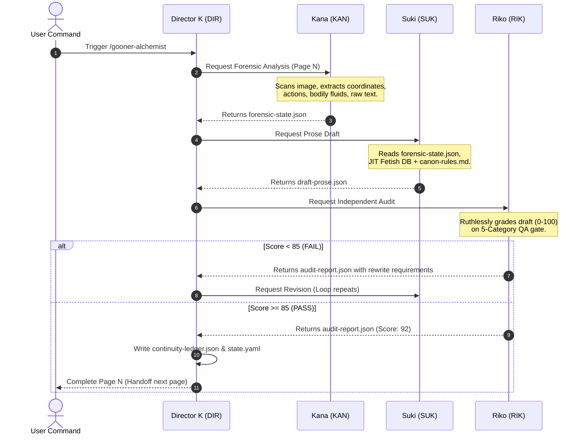

# 🛡️ API and Agent Communication Contracts 🛡️

> **Dynamic Dispatch entry points and inter-agent payload contracts**
> Documents how agents communicate, handoff execution states, and receive parameters in the adaptation loop.

---

## 🚀 Entry Point Commands (/slash mappings)

LND Studio processes input sources by routing them through specialized pipeline entries. Each entry point is associated with a primary orchestrator (usually Director K) and triggers a sequential flow:

### 1. `/gooner-alchemist` (Manga Adaptation)
* **Goal:** Convert raw Japanese manga image folders into fully audited Vietnamese prose.
* **Input Parameter:**
  ```json
  {
    "source_dir": "sources/manga_volume_01/",
    "start_page": 1,
    "scan_mode": "full",
    "fetish_tag": "bedroom"
  }
  ```
* **Primary Agent:** `DIR` (Director K)
* **Execution Flow:** Vision (`ATO` + `KAN`) ➔ Draft (`SUK`) ➔ Audit (`RIK`) ➔ Persist (`ORI`) ➔ Packaging (`COM`).

### 2. `/renpy-adaptation` (Visual Novel Adaptation)
* **Goal:** Parse `.rpy` scripts, extract dialogues/decisions, and translate/re-write into standard novel format.
* **Input Parameter:**
  ```json
  {
    "script_file": "sources/game_scripts/chapter_1.rpy",
    "output_format": "markdown",
    "pov_character": "Hero"
  }
  ```
* **Primary Agent:** `DIR` (Director K)
* **Execution Flow:** Extractor (`ORI`) ➔ Rewrite (`SUK`) ➔ Dialogue localization (`MIK`) ➔ Final Packaging (`COM`).

### 3. `/dialogue-scripting` (Dialogue & SFX Enhancement)
* **Goal:** Localize conversational speech, normalize character tones, and suggest contextual Romaji SFX.
* **Input Parameter:**
  ```json
  {
    "draft_path": "studio/output/draft.md",
    "lexicon_match": true,
    "intensity_level": "high"
  }
  ```
* **Primary Agent:** `MIK` (Miki)
* **Execution Flow:** Dialogue Extraction ➔ SFX DB Lookup ➔ Tone Matching ➔ Insertion.

---

## 🔄 Inter-Agent State Handoff Pipeline

LND Studio uses a Red-Team/Blue-Team pipeline to prevent self-bias. The flow of state data follows a strict contract:



---

## 📝 Payload Schema Structure

All JSON interchanges between agents are strictly validated. Loose fields are automatically discarded to keep clean state boundaries.
* **Vision to Prose Handoff:** Includes environmental elements, character positions, visible speech balloons, and action description.
* **Prose to Scorer Handoff:** Includes draft paragraphs, active point-of-view, total word count, and sensory density count.
* **Scorer to Orchestrator Handoff:** Includes audit pass/fail boolean, numeric score, list of violating strings, and actionable rewrite recommendations.
