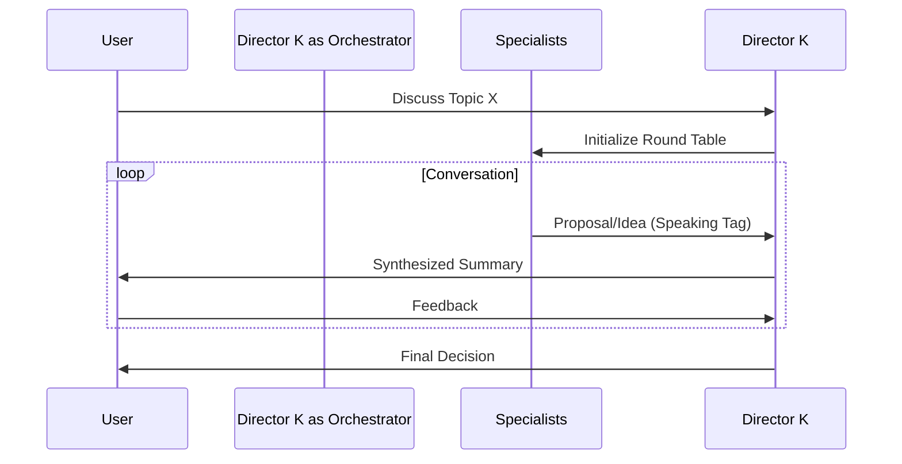

# Architecture: LND Framework

## Architectural Pattern
The LND Framework implements a **Hierarchical Agentic Workflow** pattern.
1.  **Orchestrator (L1)** acts as the API Gateway/Controller.
2.  **Specialist Agents (L2)** act as Microservices (Stateless or context-dependent).
3.  **Auditors (L3)** act as Integration Tests/Quality Gates.

## Core Pipelines

### 1. Gooner Alchemist Pipeline (Manga to Prose)
The primary workflow for converting visual media to text.

```mermaid
graph TD
    User[User Input] -->|Image/Page| Director K[L1: Director K]
    Director K -->|Invoke| Workflow[Gooner Alchemist Workflow]
    
    subgraph "Phase 1: Analysis"
        Workflow -->|Vision| Forensics[Panel Forensic]
        Forensics -->|JSON/MD| Blueprint[Blueprint]
    end
    
    subgraph "Phase 2: Creation"
        Blueprint -->|Context| Suki[L2: Suki]
        Suki -->|Draft| Prose[Prose Draft]
    end
    
    subgraph "Phase 3: Validation"
        Prose -->|Review| Riko[L3: Riko]
        Riko -- Pass --> User
        Riko -- Fail --> Suki
    end
```

### 2. Party Mode (Collaborative State)
A stateful discussion loop for brainstorming.



## Data Flow
- **Input**: Raw text/images in `sources/`
- **Processing**: Temporary memory + State files
- **Output**: Structured Markdown in `output/` (Artifacts)
- **Knowledge**: Read-only access to `studio/docs/`

## Integration Points
- **MCP Integration**: `sequential-thinking` used for complex logic (Forensics/Audit).
- **Vision Integration**: Used by `panel-forensic` (if model supports it) or manual description.
